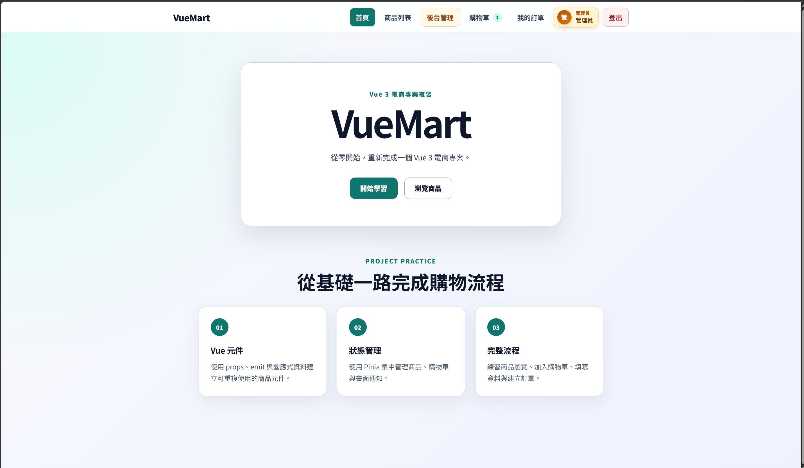
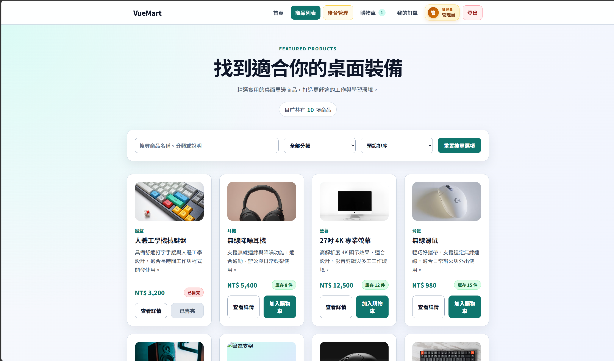
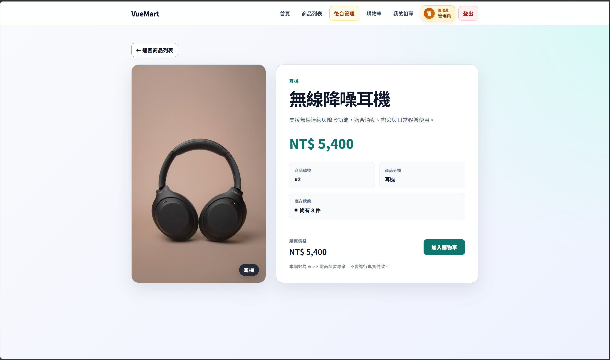
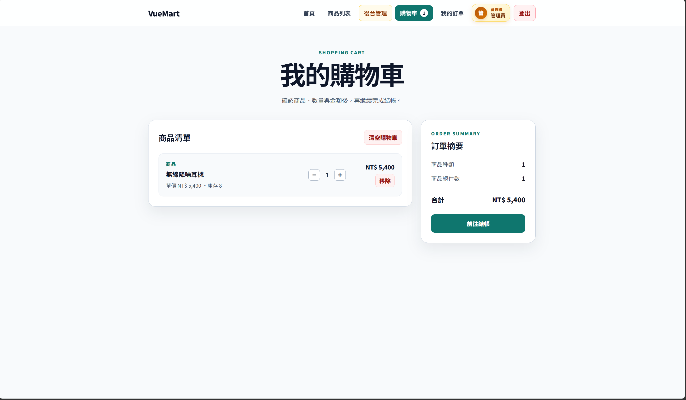
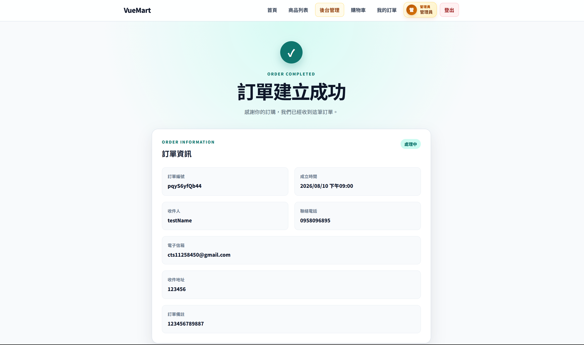
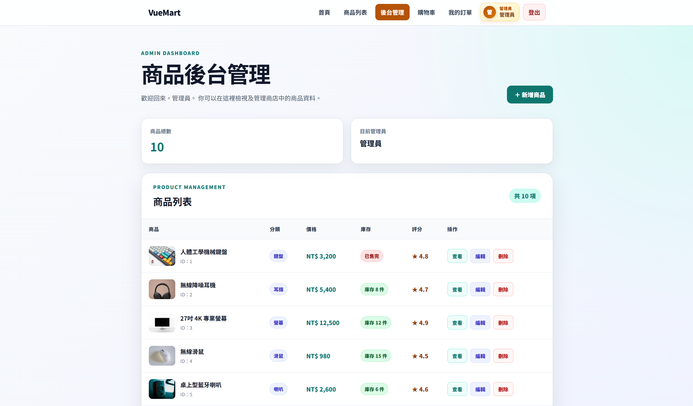
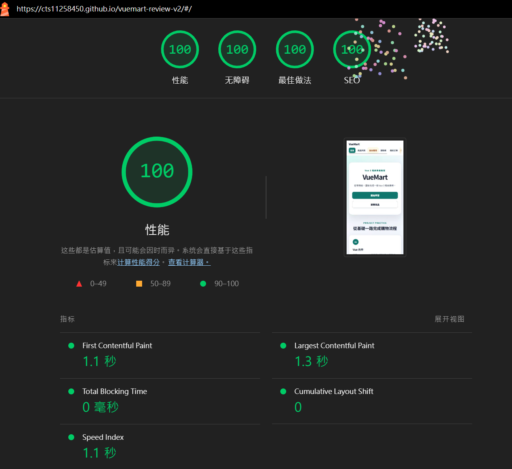

# VueMart Review V2

VueMart Review V2 是一個使用 Vue 3 建立的電商前端練習專案。

本專案從 Vite 初始化開始，逐步完成商品瀏覽、搜尋篩選、購物車、會員系統、結帳、訂單紀錄及後台商品 CRUD，並使用 JSON Server 模擬 REST API。

開發過程著重於 Vue 3 Composition API、元件拆分、Pinia 狀態管理、Vue Router 路由權限、非同步 API 操作、表單驗證、錯誤處理及響應式 CSS。

---

## 專案畫面

### 首頁

首頁介紹 VueMart 專案內容，並提供前往商品列表的主要操作入口。



### 商品列表

商品頁提供關鍵字搜尋、分類篩選及價格排序，並將操作狀態同步至 Route Query。



### 商品詳細頁

商品詳細頁顯示商品圖片、價格、庫存、評分及商品說明，並提供加入購物車功能。



### 購物車

購物車支援數量調整、庫存限制、刪除商品，以及總數量與總金額計算。



### 結帳頁

結帳頁包含收件資料驗證、訂單摘要及防止重複送出的非同步處理。



### 後台商品管理

管理員可以透過後台介面新增、編輯及刪除商品，並使用確認對話框避免誤刪。



---

## Lighthouse 品質檢查

本專案部署至 GitHub Pages 後，使用 Chrome Lighthouse 的 Mobile Navigation 模式進行正式環境檢測。

| 檢測項目           |  分數 |
| -------------- | --: |
| Performance    | 100 |
| Accessibility  | 100 |
| Best Practices | 100 |
| SEO            | 100 |

### 效能最佳化成果

為減少首頁首次載入時不必要的 JavaScript 與 CSS，本專案將 Vue Router 的頁面元件由靜態匯入改為動態 `import()`，實作路由懶載入及程式碼分割。

Vite 建置後會將首頁、商品、會員、訂單及後台頁面分割為不同 chunk；使用者第一次進入對應路由時，才下載該頁面需要的程式。

本次 Lighthouse 測試結果如下：

| 效能指標                     |   優化前 |   優化後 |
| ------------------------ | ----: | ----: |
| Performance              |    99 |   100 |
| First Contentful Paint   | 1.7 秒 | 1.1 秒 |
| Largest Contentful Paint | 1.7 秒 | 1.3 秒 |
| Total Blocking Time      |  0 毫秒 |  0 毫秒 |
| Cumulative Layout Shift  |     0 |     0 |
| Speed Index              | 2.1 秒 | 1.1 秒 |

> Lighthouse 分數可能受到測試裝置、網路狀態及瀏覽器環境影響；以上數據為本次正式部署環境的測試結果。




## 線上展示

- [開啟 VueMart Review V2](https://cts11258450.github.io/vuemart-review-v2/)
- [查看 GitHub Repository](https://github.com/cts11258450/vuemart-review-v2)

> 本專案使用 GitHub Pages 部署。正式展示環境使用前端模擬資料與 localStorage；本機開發環境則可搭配 JSON Server 測試商品、訂單及會員 API。

## 專案功能

### 商品系統

- 商品列表顯示
- 商品詳細頁
- 商品名稱搜尋
- 商品分類篩選
- 商品價格排序
- 使用 Route Query 保存搜尋條件
- 商品庫存狀態顯示
- 售完商品操作限制
- 商品載入、錯誤及空資料狀態

### 購物車

- 將商品加入購物車
- 相同商品自動累加數量
- 增加及減少商品數量
- 商品庫存上限檢查
- 移除購物車商品
- 清空購物車
- 自動計算商品總數量
- 自動計算訂單總金額
- 使用 localStorage 保存購物車

### 會員系統

- 會員註冊
- 會員登入與登出
- 重複 Email 檢查
- 表單格式驗證
- 登入狀態持久化
- 一般會員與管理員角色區分
- 登入後重新導向原本頁面
- 訪客與會員專屬路由限制

### 結帳與訂單

- 結帳資料表單
- 收件人姓名驗證
- Email 格式驗證
- 台灣手機號碼驗證
- 收件地址及備註驗證
- 防止訂單重複送出
- 訂單成功頁
- 會員訂單紀錄
- 訂單詳細內容
- 訂單所有權檢查
- 訂單成功後清空購物車
- 使用 JSON Server 保存訂單

### 後台商品管理

- 管理員專屬路由
- 後台商品列表
- 新增商品
- 編輯商品
- 刪除商品
- 商品名稱重複檢查
- 商品表單驗證
- API 操作期間防止重複送出
- 刪除確認對話框
- API 成功後同步更新 Pinia

### 使用者體驗

- Toast 操作結果通知
- LoadingState 載入狀態
- ErrorState 錯誤狀態
- EmptyState 空資料狀態
- 404 Not Found 頁面
- 響應式網頁版面
- 鍵盤焦點樣式
- 確認對話框焦點管理
- `prefers-reduced-motion` 動畫偏好支援

---

## 使用技術

### 核心技術

- [Vue 3](https://vuejs.org/)
- [Vue Router](https://router.vuejs.org/)
- [Pinia](https://pinia.vuejs.org/)
- [Vite](https://vite.dev/)
- [JSON Server](https://github.com/typicode/json-server)

### 開發技術

- Vue 3 Composition API
- `<script setup>`
- JavaScript ES Modules
- Fetch API
- REST API
- localStorage
- CSS Grid
- CSS Flexbox
- Responsive Web Design
- Git 版本控制

### 套件版本

| 套件 | 版本 |
| --- | --- |
| Vue | `^3.5.39` |
| Vue Router | `^5.2.0` |
| Pinia | `^4.0.2` |
| Vite | `^8.1.1` |
| JSON Server | `^1.0.0-beta.15` |

---

## 專案架構

```text
src/
├─ api/
│  ├─ authApi.js
│  ├─ orderApi.js
│  └─ productApi.js
│
├─ components/
│  ├─ ConfirmDialog.vue
│  ├─ EmptyState.vue
│  ├─ ErrorState.vue
│  ├─ LoadingState.vue
│  ├─ ProductCard.vue
│  ├─ SiteHeader.vue
│  └─ Toast.vue
│
├─ data/
│  └─ mockProducts.js
│
├─ router/
│  └─ index.js
│
├─ stores/
│  ├─ auth.js
│  ├─ cart.js
│  ├─ order.js
│  ├─ product.js
│  └─ toast.js
│
├─ utils/
│  ├─ formatDate.js
│  ├─ formatPrice.js
│  └─ toastHelper.js
│
├─ views/
│  ├─ AdminProductCreateView.vue
│  ├─ AdminProductEditView.vue
│  ├─ AdminProductsView.vue
│  ├─ CartView.vue
│  ├─ CheckoutView.vue
│  ├─ HomeView.vue
│  ├─ LoginView.vue
│  ├─ NotFoundView.vue
│  ├─ OrderDetailView.vue
│  ├─ OrderSuccessView.vue
│  ├─ OrdersView.vue
│  ├─ ProductDetailView.vue
│  ├─ ProductView.vue
│  └─ RegisterView.vue
│
├─ App.vue
├─ main.js
└─ style.css
```

---

## 專案資料流

商品資料的主要處理流程：

```text
View
  ↓ 呼叫 action
Pinia Store
  ↓ 呼叫 API
API 模組
  ↓ Fetch
JSON Server
  ↓ 回傳資料
API 模組
  ↓
Pinia Store 更新 state
  ↓
Vue 自動更新畫面
```

建立訂單的處理流程：

```text
CheckoutView
  ↓ 驗證結帳表單
orderStore.createOrder()
  ↓
createOrderApi()
  ↓
POST /orders
  ↓
API 建立成功
  ↓
更新 Pinia 訂單資料
  ↓
清空購物車
  ↓
前往訂單成功頁
```

API 失敗時，不會清空購物車，也不會錯誤地更新 Pinia。

---

## 路由功能

| 路徑 | 功能 | 權限 |
| --- | --- | --- |
| `/` | 首頁 | 公開 |
| `/product` | 商品列表 | 公開 |
| `/product/:id` | 商品詳細頁 | 公開 |
| `/cart` | 購物車 | 會員 |
| `/checkout` | 結帳頁 | 會員 |
| `/order-success/:id` | 訂單成功頁 | 會員 |
| `/orders` | 我的訂單 | 會員 |
| `/orders/:id` | 訂單詳細頁 | 訂單本人 |
| `/login` | 登入頁 | 訪客 |
| `/register` | 註冊頁 | 訪客 |
| `/admin/products` | 後台商品列表 | 管理員 |
| `/admin/products/create` | 新增商品 | 管理員 |
| `/admin/products/:id/edit` | 編輯商品 | 管理員 |
| 未符合路由 | 404 頁面 | 公開 |

Vue Router Navigation Guard 會根據路由的 `meta` 資料檢查：

- 是否需要登入
- 是否僅限訪客
- 是否需要管理員權限
- 登入成功後是否返回原本頁面

---

## 本機安裝與執行

### 環境需求

建議先安裝：

- Node.js
- npm
- Git

本專案開發時使用：

```text
Node.js v24.16.0
npm v11.13.0
```

### 1. 進入專案資料夾

```bash
cd vuemart-review-v2
```

### 2. 安裝套件

```bash
npm install
```

Windows PowerShell 若受到執行原則限制，可以使用：

```powershell
npm.cmd install
```

### 3. 啟動 JSON Server

開啟第一個終端機：

```bash
npm run server
```

Windows PowerShell：

```powershell
npm.cmd run server
```

JSON Server 預設位址：

```text
http://localhost:3000
```

### 4. 啟動 Vite 開發伺服器

開啟第二個終端機：

```bash
npm run dev
```

Windows PowerShell：

```powershell
npm.cmd run dev
```

前端預設位址：

```text
http://localhost:5173
```

---

## 可用指令

| 指令 | 功能 |
| --- | --- |
| `npm run dev` | 啟動 Vite 開發伺服器 |
| `npm run server` | 啟動 JSON Server |
| `npm run build` | 建立正式環境檔案 |
| `npm run preview` | 預覽正式建置結果 |

Windows PowerShell 可以將 `npm` 改成 `npm.cmd`。

---

## JSON Server API

本專案使用 `db.json` 模擬後端資料庫。

### 商品 API

| Method | Endpoint | 功能 |
| --- | --- | --- |
| `GET` | `/products` | 取得全部商品 |
| `GET` | `/products/:id` | 取得單一商品 |
| `POST` | `/products` | 新增商品 |
| `PATCH` | `/products/:id` | 更新商品 |
| `DELETE` | `/products/:id` | 刪除商品 |

### 訂單 API

| Method | Endpoint | 功能 |
| --- | --- | --- |
| `GET` | `/orders` | 取得訂單 |
| `GET` | `/orders/:id` | 取得單一訂單 |
| `POST` | `/orders` | 建立訂單 |

### 會員 API

| Method | Endpoint | 功能 |
| --- | --- | --- |
| `GET` | `/users?email=...` | 根據 Email 查詢會員 |
| `POST` | `/users` | 建立會員 |

---

## 測試管理員帳號

```text
Email：test@gmail.com
密碼：123456
```

登入管理員帳號後，可以使用：

- 後台商品列表
- 新增商品
- 編輯商品
- 刪除商品

一般會員不會顯示後台入口，直接進入後台網址時也會受到 Router Guard 限制。

---

## 開發與正式環境差異

開發環境透過以下條件使用 JSON Server：

```js
if (import.meta.env.DEV) {
  // 使用 JSON Server
}
```

執行：

```bash
npm run dev
```

此時：

```text
import.meta.env.DEV === true
```

執行：

```bash
npm run build
npm run preview
```

此時為正式建置模式，部分功能會改用：

- `mockProducts`
- localStorage
- 前端模擬資料

因此，目前正式建置預覽與 JSON Server 開發模式的資料可能不同。

---

## 錯誤處理

API 模組會負責：

- 檢查 HTTP 狀態
- 驗證 API 回傳格式
- 將錯誤拋回 Store

Pinia Store 會負責：

- 管理 Loading 狀態
- 防止重複送出
- 保存錯誤訊息
- API 成功後更新 state
- API 失敗時保留原本資料

View 則負責：

- 顯示 LoadingState
- 顯示 ErrorState
- 顯示 Toast
- 根據操作結果切換頁面

這樣可以讓 API、狀態管理與畫面顯示各自保持清楚的責任範圍。

---

## 響應式與 CSS 練習

本專案的 CSS 包含：

- 使用 Grid 建立商品列表與表單版面
- 使用 Flexbox 建立導覽列及操作列
- 使用 `minmax()` 建立彈性欄寬
- 使用 `clamp()` 建立響應式文字尺寸
- 使用 Media Query 調整手機版版面
- 使用 `position: sticky` 建立固定導覽列
- 使用 `position: fixed` 建立 Toast 與確認對話框
- 使用 `:focus-visible` 改善鍵盤操作
- 使用 Transition 提供操作回饋
- 使用 `prefers-reduced-motion` 尊重減少動畫偏好
- 使用 `overflow-wrap` 避免長文字撐破版面
- 使用高對比文字與背景提升可讀性

---

## 專案練習重點

透過這個專案，主要練習了：

1. 使用 Vue 3 Composition API 管理響應式狀態。
2. 使用 Props 與 Emits 建立元件溝通。
3. 使用 Pinia 集中管理商品、購物車、會員及訂單。
4. 使用 Vue Router 建立多頁面體驗與權限控制。
5. 使用 `async/await` 處理非同步 API。
6. 使用 `try...catch...finally` 處理錯誤及 Loading。
7. 使用 JSON Server 模擬 REST API。
8. 使用 localStorage 保存登入與購物車狀態。
9. 使用表單驗證避免錯誤資料送出。
10. 使用 Git commit 保存各階段開發紀錄。
11. 使用響應式 CSS 完成桌面與手機版面。
12. 建立具備新增、讀取、更新及刪除功能的後台管理介面。

---

## 專案限制

本專案目前以學習及作品展示為目的，因此具有以下限制：

- JSON Server 只適合本機開發及 API 模擬。
- 登入 Token 為前端模擬資料，不是真正的伺服器驗證。
- 前端 Router Guard 不能取代後端權限檢查。
- JSON Server 會員密碼沒有進行雜湊。
- 正式環境尚未連接真正的資料庫與後端服務。
- 商品圖片使用外部圖片網址。

請勿在此專案中輸入真實密碼、電話、地址或其他敏感資料。

---

## 後續規劃

- 加入專案畫面截圖
- 建立 GitHub Repository
- 部署前端網站
- 串接可部署的後端或雲端資料庫
- 加入 ESLint 與程式碼格式檢查
- 加入單元測試及元件測試
- 改用環境變數管理 API 網址
- 評估導入 TypeScript
- 改善無障礙操作與效能

---

## 專案狀態

目前已完成：

- 商品前台功能
- 購物車及結帳流程
- 會員註冊與登入
- 訂單紀錄
- JSON Server API
- 後台商品 CRUD
- 路由權限控制
- API 錯誤狀態處理
- 響應式版面
- 正式建置測試

目前專案處於功能開發完成、準備整理截圖與部署的階段。
